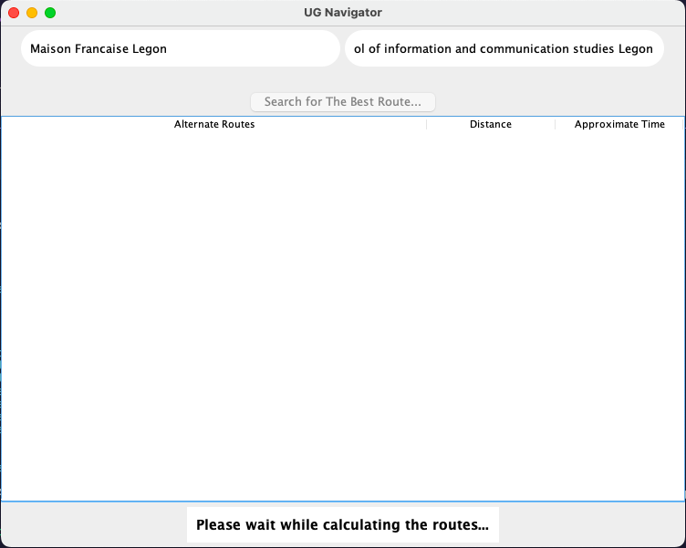
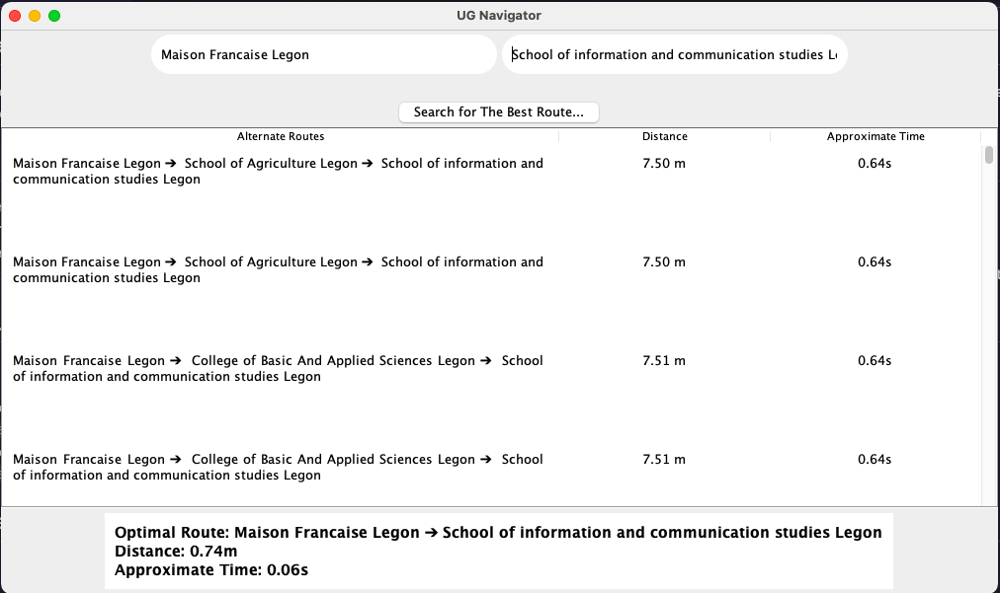
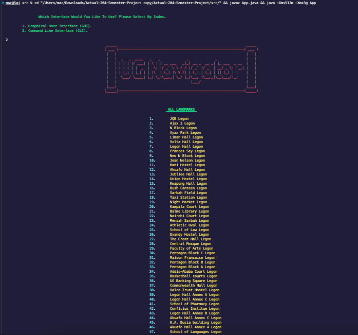
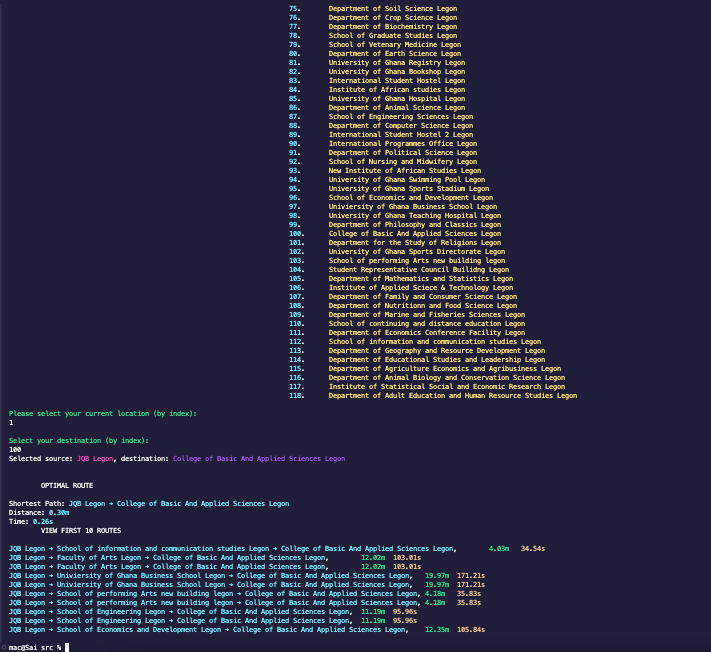

```
                                             _____                                                               _____ 
                                            ( ___ )-------------------------------------------------------------( ___ )
                                             |   |                                                               |   | 
                                             |   |  _   _  ____   _   _             _             _              |   | 
                                             |   | | | | |/ ___| | \ | | __ ___   _(_) __ _  __ _| |_ ___  _ __  |   | 
                                             |   | | | | | |  _  |  \| |/ _` \ \ / / |/ _` |/ _` | __/ _ \| '__| |   | 
                                             |   | | |_| | |_| | | |\  | (_| |\ V /| | (_| | (_| | || (_) | |    |   | 
                                             |   |  \___/ \____| |_| \_|\__,_| \_/ |_|\__, |\__,_|\__\___/|_|    |   | 
                                             |   |                                    |___/                      |   | 
                                             |___|                                                               |___| 
                                            (_____)-------------------------------------------------------------(_____)
```

# University of Ghana Optimal Routing Solution

## Project Overview

This project is focused on developing an optimal routing solution for the University of Ghana campus. The application leverages various algorithms to calculate the shortest paths and provide users with efficient routes between different landmarks on the campus.

## Features

- **Routing Algorithms**: Implementations of Dijkstra's Algorithm amongst others.
- **Optimization Techniques**: Includes Dynamic Programming among others.
- **Sorting and Searching**: Uses Merge Sort as well as Depth First Search (DFS).
- **User Interface**: A graphical user interface (GUI) for ease of interaction and visualization of routes and distances as well as a command line interface for text based visualization.

## Project Structure

The project is organized into the following main components:

- `App.java`: The main entry point for the application. It initializes the application and manages the routing algorithms.
- `AsciiColors.java`: Utility class for handling ANSI escape codes for coloring terminal text. Provides constants for various text and background colors, text attributes, and methods for wrapping text with color codes..
- `BFS.java`: Used to perform Breadth-First Search (BFS) on a graph to find all paths from a source node to a destination node..
- `CLI.java`: Command Line Interface (CLI) utility for interacting with a graph. Provides options to select nodes, find paths, and display results.
- `CSVParser.java` : A utility class to parse CSV files and populate a Graph with nodes and edges.
- `Dijkstra.java`: A utility class to implement Dijkstra's algorithm for finding the shortest path in a weighted graph.
- `Edge.java`: Represents an edge between two nodes in a graph with distance and time attributes.
- `Graph.java`: Represents a graph with nodes and edges.
- `GUI.java`: The GUI class provides a graphical user interface for the UG Navigator application. It includes search bars for selecting locations, a table to display routes, and buttons to trigger route calculations.
- `MergeSort.java`: Contains implementations for merge sort to sort distances and string lengths.
- `Node.java`: Represents a node in the graph with its associated name.


## How to Run the Application

To run the application, use the following command in your terminal:

```bash
cd <path to your src directory> && javac App.java && java -Xms512m -Xmx3g App

OR

javac App.java && java -Xms512m -Xmx3g App  # if you are already in the src directory
```

This command will navigate to the directory containing the source code, compile the `App.java` file, and run the application with specified memory settings.

###### Please Note That You would need sufficient space in order to run this program.
Here's how the images can be presented in tables for both the GUI and CLI interfaces:

### GUI Interface

|   |  |
|-------------|-------------|
|  |  |

### CLI Interface

|   |  |
|-------------|-------------|
|  |  |


## Contribution

Here are the Group Members Who Partook in this Project.


| Name                            | Student ID |
|---------------------------------|------------|
| Mensah Lartey Isaiah Nii Larte  | 11222100    |
| Boateng Cyril Konadu            | 11124483    |
| Anti Bright Gyeadu              | 11340436    |
| Lartey Kofi Sarpei              | 11333137    |
| Thomas Tetteh Lartey            | 11223578    |
| Yussif Mutawakil                | 11252675    |
| Adjei-Gyebi Minta Okatakyie     | 11040586    |

